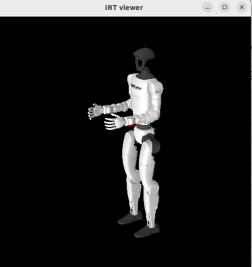

# g1eus


## Setup

### Clone this repository in your catkin workspace (ros1)
```
mkdir -p <desirable path to your catkin workspace>/src
cd <path to your catkin workspace>/src
git clone git@github.com:Michi-Tsubaki/jsk_robot.git -b support-eus-unitree-g1
```


### Build package
Please install ROS 1 and some development tools like rosdep, vcstools at first.

Then build the packages by running the following commands.

```shell
source /opt/ros/<ROS DISTRO>/setup.bash
cd <path to your catkin workspace>/src
wget https://raw.githubusercontent.com/Michi-Tsubaki/jsk_robot/refs/heads/support-eus-unitree-g1/jsk_g1_robot/g1eus/ros-o.repos.yaml -O- | vcs import
sudo apt update && rosdep update && rosdep install -iqry --from-paths .
cd ..
catkin build g1eus
```


## How to use real robot

### Build g1_ros (ROS2 package)

```bash
source /opt/ros/<ROS2 DISTRO>/setup.bash
mkdir -p <path to your desirable colcon workspace>/src
cd <path to colcon workspace>/src
wget https://raw.githubusercontent.com/mqcmd196/g1_ros/refs/heads/master/jazzy.repos.yaml -O- | vcs import
sudo apt update && rosdep update && rosdep install -iqry --from-paths .
cd ..
colcon build --symlink-install --packages-up-to g1_bringup
```

For more information, please visit [g1_ros](https://github.com/mqcmd196/g1_ros)

### Install ros1_bridge
ros1_bridge is a ROS2 package. Please check [here](https://github.com/ros-o/ros1_bridge)

The deb file for this package is shared at https://drive.google.com/file/d/1jXZlvovTGa_PU6stJOznvv5ZYkarB62n/view?usp=sharing

Please download this deb file and install the package:

```bash
cd ~/Downloads
sudo apt install ./ros-jazzy-ros1-bridge_0.10.3-0noble_amd64.deb
```


### Preparation

#### Connect Ethernet cable from g1 to your computer

Please connect your computer to the robot following [official instruction](https://support.unitree.com/home/en/G1_developer/quick_development#heading-7). Please check the network interface name.

Also please allocate the correct IP adress instructed [official instruction](https://support.unitree.com/home/en/G1_developer/quick_development#heading-7) manually.


### Execution

- terminal 1

```bash
source <path to your catkin ws>/devel/setup.bash
roscore
```

- terminal 2 (Bringup hands)

```bash
ssh unitree@192.168.123.164  # default password is 123
cd dfx_inspire_service/build/
sudo ./inspire_g1 -k -u
```

- terminal 3 (Bringup robot as a ROS2 robot)

```bash
source <path_to_your_colcon_ws>/install/setup.bash
ros2 launch g1_bringup g1_bringup.launch.py network_interface:=<network (ex. enp0s31f6)> hand_type:=inspire_dfq
```

- terminal 4 (Activate ros2_control upper_body_controller)
```bash
source <path_to_your_colcon_ws>/install/setup.bash
ros2 control set_controller_state upper_body_controller active
```

- terminal 5 (Bridge ros2 topic and action to ros1 topic and actionlib)
```bash
source <path_to_your_colcon_ws>/install/setup.bash
source <path_to_your_catkin_ws>/devel/setup.bash
ros2 run ros1_bridge dynamic_bridge --bridge-all-topics
```

- terminal 6 ~ (Optional)
Please run your own program using g1-interface.l like

```shell
source <path_to_your_catkin_ws>/devel/setup.bash
```

```lisp
(load "package://g1eus/g1-interface.l")
```

### If you want to do teleoperation using spacenav

- terminal 6

``` bash
source <path_to_your_catkin_ws>/devel/setup.bash
roslaunch jsk_generic_teleop spacenav_classic.launch
```


## Tips

- Hand Interface

```roseus
(send *ri* :hand-angle-vector :larm #f(0 0 0 0 0 0) 1000) ;; to move left hand.

;; Open
(send *ri* :stop-grasp :larm) ;; to move left hand.
;; Before grasping
(send *ri* :prepare-grasp :larm) ;; to move left hand.
;; Grasp
(send *ri* :start-grasp :larm) ;; to move left hand.
;; Power-of position
(send *ri* :default-grasp :larm) ;; to move left hand.
```

Other methods than the hand interface is inherit from pr2eus.
