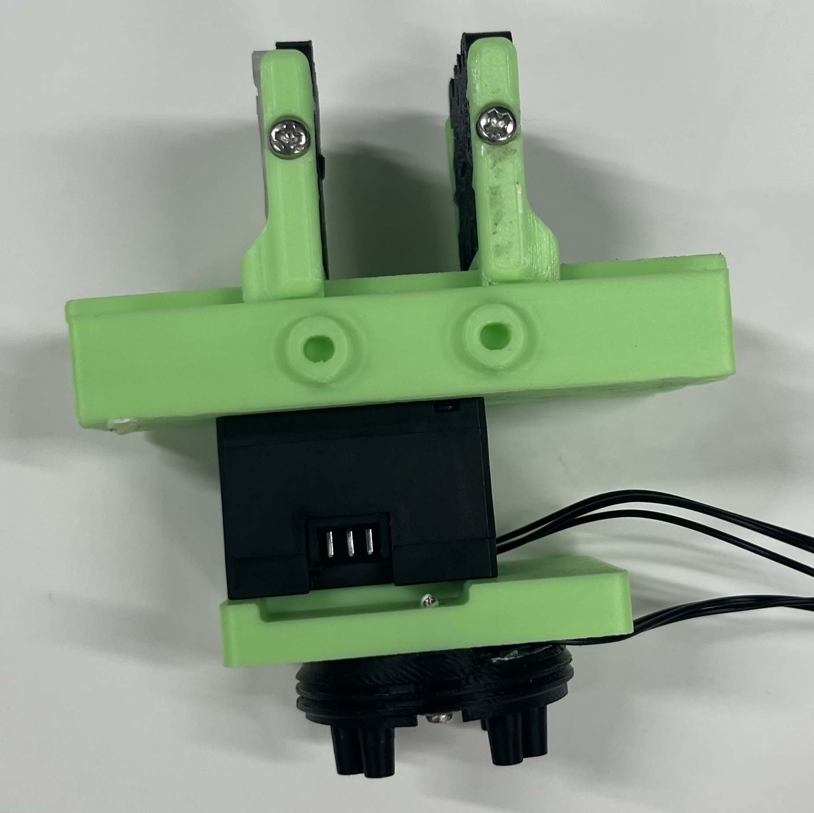
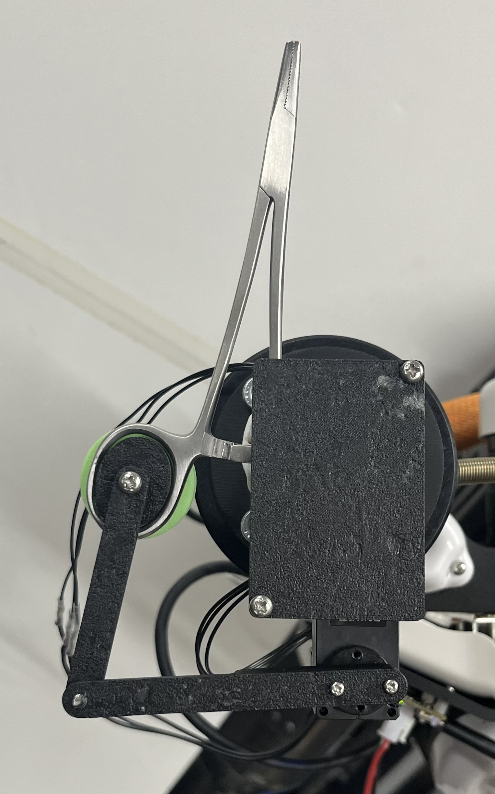

# dynamixel_detachable_han
This package provides launch files and eus lisp utils for dynamixcel detachanble hand device.

## List of Device
- Hands
This hand is prepared by Tasuku Makabe for KXR Robot (for Kondo Kagaku Motor). I modified some parts for Dynamixel motor.
  - Default


- Forceps holder


## Installation
```bash
mkdir -p ~/catkin_ws/src
cd ~/catkin_ws/src
wstool init
wstool merge https://raw.githubusercontent.com/jsk-ros-pkg/jsk_robot/master/jsk_hand/dynamixel_detachable_hand/dynamixel_detachable_hand_usr.rosinstall
wstool update
cd ../
source /opt/ros/<Your ROS Distribution>/setup.bash
rosdep install -y -r --from-paths src
catkin build dynamixel_detachable_hand
source devel/setup.bash
```

## Setup
1. Please check the device information from the following command. In case your device is `/dev/ttyUSB0`,
```bash
udevadm info -a -n /dev/ttyUSB0
```

2. Please edit the udev file.
```bash
roscd dynamixel_detachable_hand/udev
emacs -nw 90-dual-hands.rules
```

3. Please create the udev rule.
```bash
roscd dynamixel_detachable_hand/scripts
./create_udev_rules.sh
```

4. Please activate the udev rule.
```bash
sudo udevadm control --reload-rules
sudo udevadm trigger
```

## Usage
1. Please launch the following file. If your devices are connected, your devices will be launched!
```bash
roslaunch dynamixel_detachable_hand dual_hand.launch
```

2. Please open `roseus` interpreter.
```bash
emacs -nw
M+x shell
roseus
```

3. In your roseus interpreter, please load the following files. 
```roseus
(require "package://dynamixel_detachable_hand/euslisp/rhand-interface.l")
(require "package://dynamixel_detachable_hand/euslisp/lhand-interface.l")
```

4. For example, you can open and close the hands by running the following commands.
```roseus
(dotimes (i 10)
  (send *rhand* :open-holder)
  (send *lhand* :open)
  (unix:sleep 1)
  (send *rhand* :close-holder)
  (send *lhand* :close)
  (unix:sleep 1)
  )
```

**Description** :
`:open` and `:close` methods are for the KXR parallel grriper modified for dynamixel motor. `:open-holder` and `:close-holder` methods are for the hergar needle holder device. I plan to prepare other methods like `:open-forceps` `:close-forceps`. The difference is the position value and velocity.

- You can also use python interface (methods name is the same as euslisp interface.
Please see `scripts/test_hand.py`
