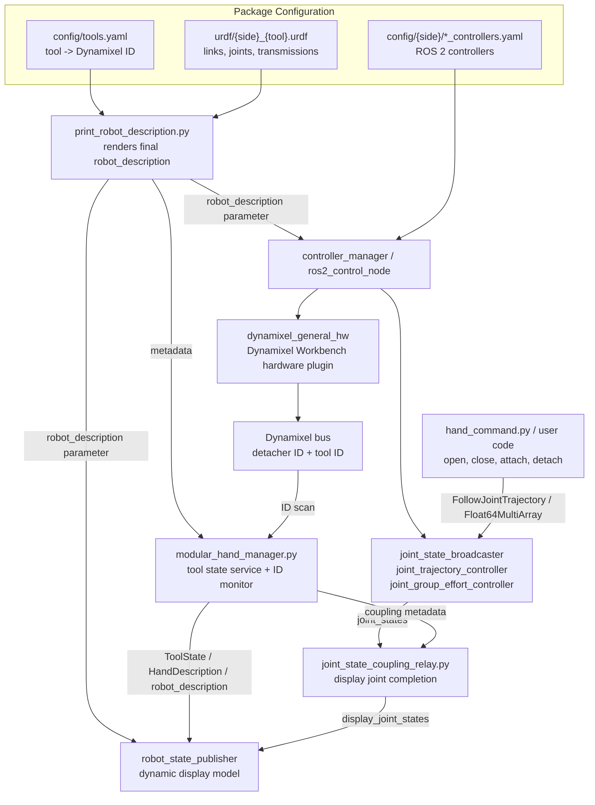

# dynamixel_detachable_hand

ROS 2 package for a surgical detachable tool modules using Dynamixel Motor.

## Design

The package treats `robot_description` as the runtime contract.
Source URDF files provide the geometry and transmissions.
At launch time `print_robot_description.py` renders a final URDF by adding:

- `<ros2_control>` with `dynamixel_general_hw/DynamixelGeneralHw`
- Dynamixel ID, `Operating_Mode`, torque constant, command interfaces, and
  state interfaces
- detachable-tool metadata used by the manager, services, and smoke tests
- optional nonlinear display coupling metadata for the needle holder

Tool identity is resolved from Dynamixel IDs in `config/tools.yaml`.
The `modular_hand_manager.py` node can monitor configured IDs and update the published model when a tool is attached or removed.
Model-side updates are dynamic.
If the physical `ros2_control` hardware joint set changes, restart the controller stack so `controller_manager` can load a new URDF cleanly.


```mermaid
flowchart TB
  subgraph Config["Package Configuration"]
    Tools["config/tools.yaml<br/>tool -> Dynamixel ID"]
    SourceURDF["urdf/{side}_{tool}.urdf<br/>links, joints, transmissions"]
    Controllers["config/{side}/*_controllers.yaml<br/>ROS 2 controllers"]
  end

  Renderer["print_robot_description.py<br/>renders final robot_description"]
  Manager["modular_hand_manager.py<br/>tool state service + ID monitor"]
  Coupling["joint_state_coupling_relay.py<br/>display joint completion"]

  RSP["robot_state_publisher<br/>dynamic display model"]
  CM["controller_manager / ros2_control_node"]
  HW["dynamixel_general_hw<br/>Dynamixel Workbench hardware plugin"]
  Motors["Dynamixel bus<br/>detacher ID + tool ID"]
  ControllersRun["joint_state_broadcaster<br/>joint_trajectory_controller<br/>joint_group_effort_controller"]
  Client["hand_command.py / user code<br/>open, close, attach, detach"]

  Tools --> Renderer
  SourceURDF --> Renderer
  Renderer -->|"robot_description parameter"| RSP
  Renderer -->|"robot_description parameter"| CM
  Renderer -->|"metadata"| Manager
  Controllers --> CM
  CM --> HW
  HW --> Motors
  CM --> ControllersRun
  Motors -->|"ID scan"| Manager
  Manager -->|"ToolState / HandDescription / robot_description"| RSP
  ControllersRun -->|"joint_states"| Coupling
  Manager -->|"coupling metadata"| Coupling
  Coupling -->|"display_joint_states"| RSP
  Client -->|"FollowJointTrajectory / Float64MultiArray"| ControllersRun
```

## Python Environment

This package is built with `ament_cmake`, including its Python modules.  For a
Python virtual environment, use system site packages so ROS 2 Python modules
such as `rclpy`, `launch_xml`, and generated interfaces remain visible:

```bash
cd ~/colcon_ws/src/jsk-ros-pkg/jsk_robot/jsk_hand/dynamixel_detachable_hand
uv venv --system-site-packages .venv
source .venv/bin/activate
source /opt/ros/jazzy/setup.bash
uv pip install -e .
```

When `.venv/bin/python3` exists during CMake configuration, installed ROS 2
entry-point scripts get that interpreter in their shebang.  Without `.venv`,
the build falls back to CMake's `Python3_EXECUTABLE`.

Build from the workspace root:

```bash
cd ~/colcon_ws
colcon build --packages-up-to dynamixel_detachable_hand
source install/setup.bash
```

Run smoke tests without hardware:

```bash
cd ~/colcon_ws/src/jsk-ros-pkg/jsk_robot/jsk_hand/dynamixel_detachable_hand
source .venv/bin/activate
source /opt/ros/jazzy/setup.bash
PYTHONPATH=src:$PYTHONPATH python3 -m pytest -q
PYTHONPATH=src:$PYTHONPATH python3 scripts/hand_command.py --side lhand detach --dry-run
PYTHONPATH=src:$PYTHONPATH python3 scripts/print_robot_description.py --side lhand --tool generic --summary
```

Run ROS 2 launch files:

```bash
ros2 launch dynamixel_detachable_hand hand_model.launch.xml side:=lhand tool:=generic
ros2 launch dynamixel_detachable_hand hand_control.launch.xml side:=lhand tool:=generic port_name:=/dev/lhand
ros2 launch dynamixel_detachable_hand hand_detacher.launch.xml side:=lhand port_name:=/dev/lhand
ros2 launch dynamixel_detachable_hand dual_hand.launch.xml left_tool:=generic right_tool:=generic
```

The command interface supports dry-run and real controller commands:

```bash
ros2 run dynamixel_detachable_hand hand_command.py --side lhand detach --dry-run
ros2 run dynamixel_detachable_hand hand_command.py --side lhand attach
ros2 run dynamixel_detachable_hand hand_command.py --side lhand open
ros2 run dynamixel_detachable_hand hand_command.py --side lhand close
```

## Hardware Setup

Install the udev rules if the hands should appear as `/dev/lhand` and
`/dev/rhand`:

```bash
cd ~/colcon_ws/src/jsk-ros-pkg/jsk_robot/jsk_hand/dynamixel_detachable_hand
sudo scripts/create_udev_rules.sh
sudo udevadm control --reload-rules
sudo udevadm trigger
```

The attached tool model can be selected per side.  Available tool names are
`generic`, `needle_holder`, `gripper`, and `forceps`.  `needle_holder` uses the
SURGENOID needle-holder meshes and nonlinear four-bar display coupling;
`gripper` and `forceps` are placeholder URDFs with the same stable control
joint names.

The Dynamixel IDs are fixed by side so the manager can identify the attached
tool from an ID scan:

| Tool | Left ID | Right ID | Auto-detected name |
| --- | ---: | ---: | --- |
| Detacher motor | 0 | 1 | detached / `detacher` |
| Gripper / sesshi | 2 | 3 | `gripper` |
| Needle holder | 4 | 5 | `needle_holder` |
| Scissors / hasami | 6 | 7 | `forceps` |

`generic` is a manual fallback model and is not auto-detected.  When rendered
manually it uses the gripper motor ID for that side.

## EusLisp Interface

EusLisp task code can use the same high-level operations as the Python command
interface:

```lisp
(setq *lhand* (lhand-init))
(setq *rhand* (rhand-init))

(send *lhand* :open)
(send *lhand* :close)
(send *rhand* :open-holder)
(send *rhand* :close-holder)

(send *lhand* :attach :tm 1.0)
(send *lhand* :detach :tm 1.0)
```

The movement methods send ROS 2 `FollowJointTrajectory` goals to
`/<side>/position_joint_trajectory_controller/follow_joint_trajectory`.
The attach and detach methods command current through
`/<side>/joint_group_effort_controller/command`.
When the trajectory action server is not available, the EusLisp interface
automatically uses a local kinematic simulator for that hand.  The same
open/close/attach/detach calls remain available, and simulated hand joint
states are published on `/<side>/joint_states` for model and task-level checks.

## EusLisp tool change helper

`euslisp/tool-change.l` provides a common attach/detach API for robot tasks.

It keeps the physical detachable hand interface in this package and lets task code switch the URDF model and IK target without changing each robot model.

```lisp
(mycobot-init)
;; Current Robomech wiring maps the single mycobot arm to the lhand board.
(tool-setup-robot *mycobot* :robot-kind :mycobot)

;; Model-only switch.
(attach-tool *mycobot* :rarm :needle-holder)
(tool-ik *mycobot* :rarm target-coords :rotation-axis t)
(detach-tool *mycobot* :rarm)

;; Use this when the detachable current and controller restart are desired.
(attach-tool *mycobot* :rarm :forceps :physical t :restart-control t)
```

When `*irtviewer*` already exists, or when `nextage-init` has a `nextage-interface` in `*ri*`,
`attach-tool` and `detach-tool` automatically rebuild the viewer object list and redraw it
after the euslisp robot model is updated.
A Nextage demo can use the same helper after `nextage-init`:

```lisp
(nextage-init)
(tool-setup-robot *nextage* :robot-kind :nextage)
(objects (list *nextage*))

(attach-tool *nextage* :rarm :needle-holder)
(detach-tool *nextage* :rarm)
```

If the viewer should always include scene objects in addition to the robot,
set `*detachable-tool-irtviewer-objects*` to that list, for example
`(setq *detachable-tool-irtviewer-objects* (list *nextage* *table*))`.
The helper also adds a simple Eus visual marker for the attached tip so
irtviewer has something visible to switch.  Set
`*detachable-tool-draw-tip-visual*` to `nil` before `attach-tool` if only the IK
target should be updated.
